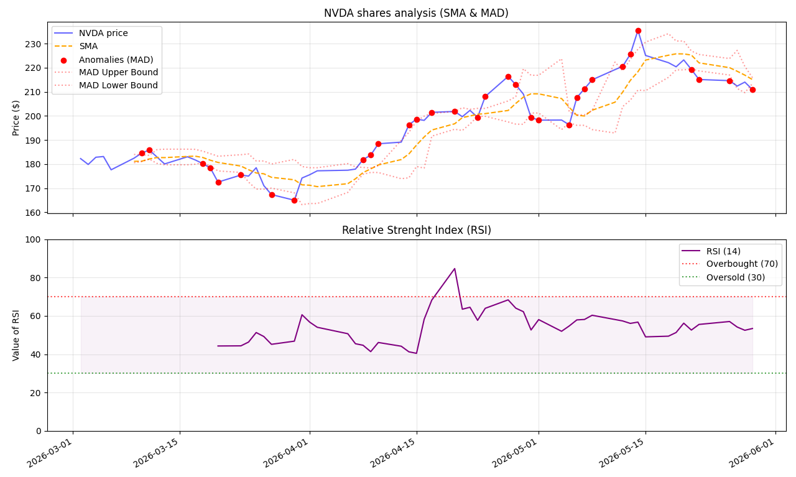
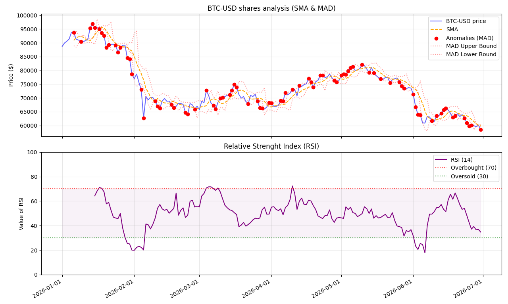

# Financial Market Analysis CLI Tool

A professional command-line interface (CLI) tool written in Python for fetching, analyzing, and visualizing financial market data from Yahoo Finance. The application automatically calculates technical indicators (SMA, RSI), detects market anomalies using Median Absolute Deviation (MAD), and generates polished, production-ready interactive charts.

## Features
- **Robust CLI Architecture:** Accepts parameters via command-line arguments with full protection against empty strings, whitespace, and case mismatches.
- **Strict Input Validation:** Bulletproof date checks block malformed calendar inputs at the entry level before making network requests.
- **Technical Analysis Engine:** Computes Simple Moving Average (SMA) and Relative Strength Index (RSI).
- **Anomaly Detection:** Employs Median Absolute Deviation (MAD) algorithms to flag unusual price movements automatically.
- **Advanced Dynamic Visualization:** Uses dynamic f-string titles, automated date scaling via `AutoDateLocator` to eliminate overlapping text, and auto-rotated labels for clear viewing over long periods.

## Demo screenshots




## Installation
```bash
git clone 
cd Financial-Market-CLI-Tool https://github.com/Kindzuls/Financial-Market-CLI-Tool.git
pip install yfinance pandas matplotlib